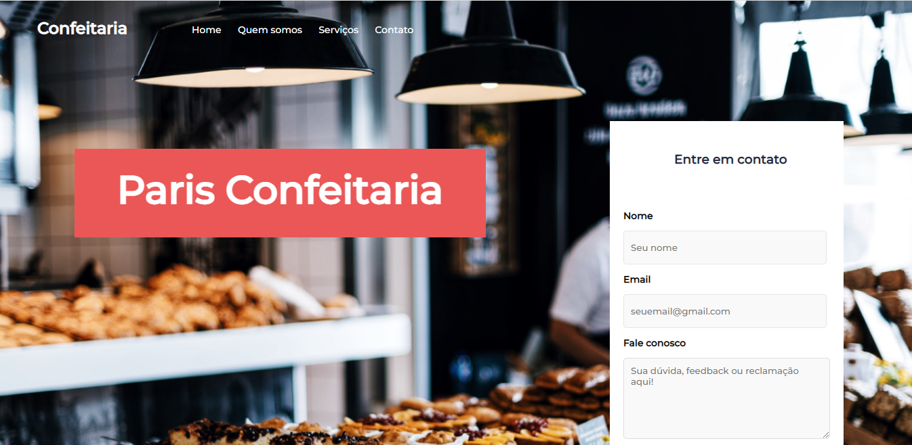

# Projeto-Padaria

> Projeto site para Padaria, com formulário, informações e curiosidades sobre a loja e produtos disponíveis para venda.
#
### Tecnologias usadas:
 
   
 

#

## 🤝 Colaboradores

<a href="https://www.linkedin.com/in/marcusviniciusbeghelisantos/" target="_blank">Marcus Vinícius</a>
 

